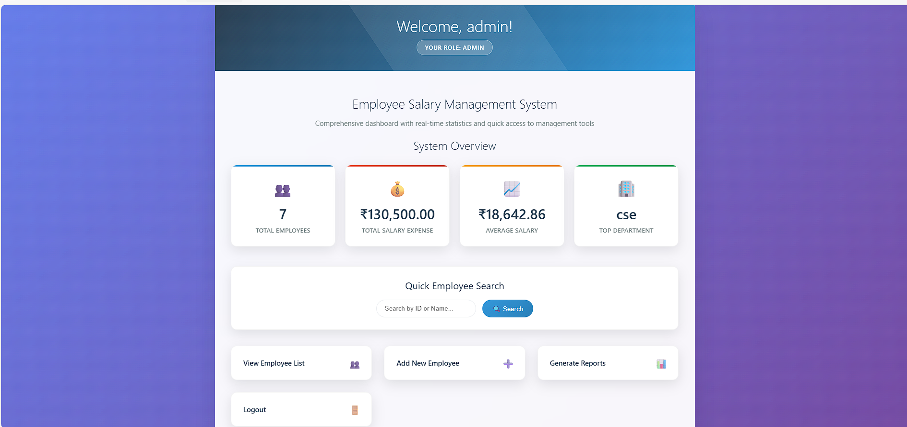
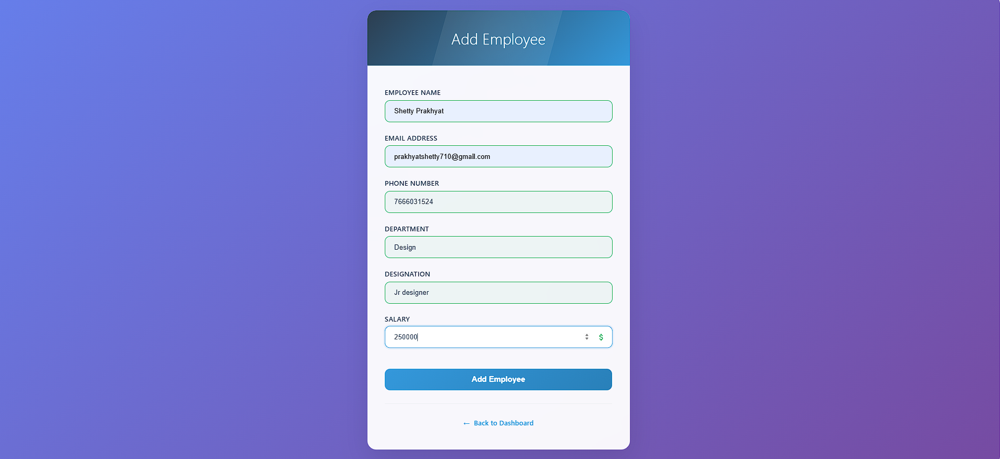
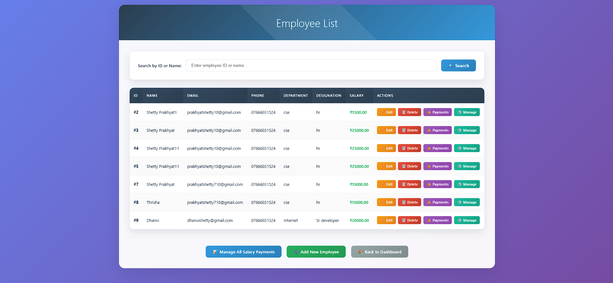

# **Employee Salary Management System**

**Subject Name**: Advanced Java  
**Subject Code**: BCS613D  
**Name**: Shetty Prakhyat 
**USN**: 4AL22CS142
**Sem/Section**: VI/C

A comprehensive web application for managing employee salary records, payroll processing, and financial reporting built with JSP, Servlets, and MySQL following MVC architecture principles.

## 🚀 Features

* **Employee Management**: Complete CRUD operations for employee records
* **Salary Calculation**: Automated salary computation with allowances and deductions
* **Payroll Processing**: Generate monthly payrolls and salary slips
* **Department Management**: Organize employees by departments and designations
* **Advanced Search**: Search employees by ID, name, department, or designation
* **Comprehensive Reports**: Generate various reports including:
   * Monthly salary reports
   * Department-wise salary analysis
   * Employee salary history
   * Tax deduction reports
   * Bonus and incentive tracking
   * Highest/Lowest paid employees
* **Salary Components**: Manage basic salary, allowances, and deductions
* **Tax Calculation**: Automatic tax computation based on salary brackets
* **Input Validation**: Client-side and server-side validation
* **Professional UI**: Bootstrap-based responsive design
* **MVC Architecture**: Clean separation of concerns
* **Database Integration**: MySQL with JDBC connectivity
* **Role-based Access**: Different access levels for HR and administrators

## 📋 Prerequisites

Before running this application, make sure you have the following installed:

* **Java Development Kit (JDK) 8 or higher**
* **Apache Tomcat 9.0 or higher**
* **MySQL Server 5.7 or XAMPP Server**
* **MySQL JDBC Driver (mysql-connector-java)**
* **IDE**: Eclipse (J2EE), IntelliJ IDEA, or any Java IDE
* **Web Browser**: Chrome, Firefox, or Edge

## 🛠️ Project Structure

```
EmployeeSalaryManagementApp/
├── src/
│   ├── dao/
│   │   ├── EmployeeDAO.java
│   │   ├── SalaryDAO.java
│   │   ├── DepartmentDAO.java
│   │   ├── PayrollDAO.java
│   │   └── ReportDAO.java
│   ├── model/
│   │   ├── Employee.java
│   │   ├── Salary.java
│   │   ├── Department.java
│   │   ├── Payroll.java
│   │   └── SalaryComponent.java
│   ├── servlet/
│   │   ├── EmployeeServlet.java
│   │   ├── SalaryServlet.java
│   │   ├── PayrollServlet.java
│   │   ├── DepartmentServlet.java
│   │   ├── ReportServlet.java
│   │   └── SearchServlet.java
│   └── util/
│       ├── SalaryCalculator.java
│       ├── TaxCalculator.java
│       └── DatabaseUtil.java
├── WebContent/
│   ├── index.jsp
│   ├── employee/
│   │   ├── add_employee.jsp
│   │   ├── update_employee.jsp
│   │   ├── view_employees.jsp
│   │   └── employee_profile.jsp
│   ├── salary/
│   │   ├── salary_structure.jsp
│   │   ├── salary_slip.jsp
│   ├── payroll/
│   │   ├── generate_payroll.jsp
│   │   ├── monthly_payroll.jsp
│   │   └── payroll_summary.jsp
│   ├── reports/
│   │   ├── report_dashboard.jsp
│   │   ├── salary_reports.jsp
│   │   ├── tax_reports.jsp
│   │   └── employee_reports.jsp
│   └── css/
│       └── style.css
├── WEB-INF/
│   └── web.xml
└── README.md
```

## 🗄️ Database Setup

### 1. Create Database

```sql
CREATE DATABASE IF NOT EXISTS employee_salary_management;
USE employee_salary_management;
```

### 2. Create Tables

```sql
-- Departments Table
CREATE TABLE IF NOT EXISTS departments (
    dept_id INT PRIMARY KEY AUTO_INCREMENT,
    dept_name VARCHAR(100) NOT NULL UNIQUE,
    dept_head VARCHAR(100),
    location VARCHAR(100),
    created_date TIMESTAMP DEFAULT CURRENT_TIMESTAMP
);

-- Employees Table
CREATE TABLE IF NOT EXISTS employees (
    emp_id INT PRIMARY KEY AUTO_INCREMENT,
    emp_code VARCHAR(20) UNIQUE NOT NULL,
    first_name VARCHAR(50) NOT NULL,
    last_name VARCHAR(50) NOT NULL,
    email VARCHAR(100) UNIQUE NOT NULL,
    phone VARCHAR(15) NOT NULL,
    date_of_birth DATE,
    hire_date DATE NOT NULL,
    dept_id INT,
    designation VARCHAR(100) NOT NULL,
    manager_id INT,
    status ENUM('Active', 'Inactive', 'Terminated') DEFAULT 'Active',
    address TEXT,
    pan_number VARCHAR(10),
    bank_account VARCHAR(20),
    created_date TIMESTAMP DEFAULT CURRENT_TIMESTAMP,
    FOREIGN KEY (dept_id) REFERENCES departments(dept_id),
    FOREIGN KEY (manager_id) REFERENCES employees(emp_id)
);

-- Salary Structure Table
CREATE TABLE IF NOT EXISTS salary_structure (
    salary_id INT PRIMARY KEY AUTO_INCREMENT,
    emp_id INT NOT NULL,
    basic_salary DECIMAL(10,2) NOT NULL,
    hra DECIMAL(10,2) DEFAULT 0,
    da DECIMAL(10,2) DEFAULT 0,
    transport_allowance DECIMAL(10,2) DEFAULT 0,
    medical_allowance DECIMAL(10,2) DEFAULT 0,
    special_allowance DECIMAL(10,2) DEFAULT 0,
    pf_deduction DECIMAL(10,2) DEFAULT 0,
    esi_deduction DECIMAL(10,2) DEFAULT 0,
    professional_tax DECIMAL(10,2) DEFAULT 0,
    income_tax DECIMAL(10,2) DEFAULT 0,
    other_deductions DECIMAL(10,2) DEFAULT 0,
    effective_from DATE NOT NULL,
    effective_to DATE,
    created_date TIMESTAMP DEFAULT CURRENT_TIMESTAMP,
    FOREIGN KEY (emp_id) REFERENCES employees(emp_id)
);

-- Payroll Table
CREATE TABLE IF NOT EXISTS payroll (
    payroll_id INT PRIMARY KEY AUTO_INCREMENT,
    emp_id INT NOT NULL,
    salary_month VARCHAR(7) NOT NULL, -- Format: YYYY-MM
    working_days INT NOT NULL,
    present_days INT NOT NULL,
    basic_salary DECIMAL(10,2) NOT NULL,
    gross_salary DECIMAL(10,2) NOT NULL,
    total_deductions DECIMAL(10,2) NOT NULL,
    net_salary DECIMAL(10,2) NOT NULL,
    bonus DECIMAL(10,2) DEFAULT 0,
    overtime_amount DECIMAL(10,2) DEFAULT 0,
    generated_date TIMESTAMP DEFAULT CURRENT_TIMESTAMP,
    generated_by VARCHAR(50),
    status ENUM('Draft', 'Approved', 'Paid') DEFAULT 'Draft',
    FOREIGN KEY (emp_id) REFERENCES employees(emp_id),
    UNIQUE KEY unique_emp_month (emp_id, salary_month)
);

-- Attendance Table (for payroll calculation)
CREATE TABLE IF NOT EXISTS attendance (
    attendance_id INT PRIMARY KEY AUTO_INCREMENT,
    emp_id INT NOT NULL,
    attendance_date DATE NOT NULL,
    check_in TIME,
    check_out TIME,
    total_hours DECIMAL(4,2) DEFAULT 0,
    overtime_hours DECIMAL(4,2) DEFAULT 0,
    status ENUM('Present', 'Absent', 'Half Day', 'Holiday', 'Leave') DEFAULT 'Present',
    remarks TEXT,
    created_date TIMESTAMP DEFAULT CURRENT_TIMESTAMP,
    FOREIGN KEY (emp_id) REFERENCES employees(emp_id),
    UNIQUE KEY unique_emp_date (emp_id, attendance_date)
);
```

### 3. Insert Sample Data

```sql
-- Sample Departments
INSERT INTO departments (dept_name, dept_head, location) VALUES 
('Human Resources', 'Sarah Johnson', 'Building A - Floor 2'),
('Information Technology', 'Rajesh Kumar', 'Building B - Floor 3'),
('Finance & Accounts', 'Priya Sharma', 'Building A - Floor 1'),
('Marketing', 'Arun Patel', 'Building C - Floor 2'),
('Operations', 'Sunita Reddy', 'Building B - Floor 1');

-- Sample Employees
INSERT INTO employees (emp_code, first_name, last_name, email, phone, date_of_birth, hire_date, dept_id, designation, status, address, pan_number, bank_account) VALUES 
('EMP001', 'Prakhyat', 'Shetty', 'shetty@company.com', '9876543210', '1995-05-15', '2022-01-15', 2, 'Software Developer', 'Active', 'Mangalore, Karnataka', 'ABCDE1234F', '1234567890123456'),
('EMP002', 'Tanya', 'Dsouza', 'dsouza@company.com', '9876543211', '1993-08-22', '2021-06-10', 2, 'Senior Developer', 'Active', 'Udupi, Karnataka', 'BCDEF2345G', '2345678901234567'),
('EMP003', 'Shravya', 'Nair', 'shravya.nair@company.com', '9876543212', '1990-12-10', '2020-03-20', 1, 'HR Manager', 'Active', 'Bangalore, Karnataka', 'CDEFG3456H', '3456789012345678'),
('EMP004', 'Swanjith', 'AS', 'swanjith.as@company.com', '9876543213', '1988-04-18', '2019-09-05', 3, 'Financial Analyst', 'Active', 'Mumbai, Maharashtra', 'DEFGH4567I', '4567890123456789'),
('EMP005', 'tanay', 'SM', 'tanay.sm@company.com', '9876543214', '1992-11-25', '2023-02-01', 2, 'Junior Developer', 'Active', 'Chennai, Tamil Nadu', 'EFGHI5678J', '5678901234567890');

-- Sample Salary Structures
INSERT INTO salary_structure (emp_id, basic_salary, hra, da, transport_allowance, medical_allowance, special_allowance, pf_deduction, esi_deduction, professional_tax, income_tax, effective_from) VALUES 
(1, 35000.00, 14000.00, 3500.00, 2000.00, 1500.00, 5000.00, 4200.00, 875.00, 200.00, 3500.00, '2022-01-15'),
(2, 55000.00, 22000.00, 5500.00, 3000.00, 2000.00, 8000.00, 6600.00, 1375.00, 200.00, 8500.00, '2021-06-10'),
(3, 65000.00, 26000.00, 6500.00, 3500.00, 2500.00, 10000.00, 7800.00, 1625.00, 200.00, 12000.00, '2020-03-20'),
(4, 45000.00, 18000.00, 4500.00, 2500.00, 2000.00, 6000.00, 5400.00, 1125.00, 200.00, 5500.00, '2019-09-05'),
(5, 28000.00, 11200.00, 2800.00, 1500.00, 1200.00, 3500.00, 3360.00, 700.00, 200.00, 2200.00, '2023-02-01');

-- Sample Payroll Records
INSERT INTO payroll (emp_id, salary_month, working_days, present_days, basic_salary, gross_salary, total_deductions, net_salary, status) VALUES 
(1, '2025-05', 22, 22, 35000.00, 61000.00, 8775.00, 52225.00, 'Approved'),
(2, '2025-05', 22, 21, 55000.00, 95500.00, 17175.00, 78325.00, 'Approved'),
(3, '2025-05', 22, 22, 65000.00, 113000.00, 21825.00, 91175.00, 'Paid'),
(4, '2025-05', 22, 20, 45000.00, 78000.00, 12225.00, 65775.00, 'Approved'),
(5, '2025-05', 22, 22, 28000.00, 48200.00, 6460.00, 41740.00, 'Draft');
```

## ⚙️ Installation & Setup

### Step 1: Clone/Download the Project
Download all the project files and organize them according to the project structure above.

### Step 2: Database Configuration
1. Start your MySQL server
2. Run the database setup scripts provided above
3. Update database credentials in `DatabaseUtil.java`:

```java
public class DatabaseUtil {
    private static final String URL = "jdbc:mysql://localhost:3306/employee_salary_management";
    private static final String USERNAME = "your_username";
    private static final String PASSWORD = "your_password";
    
    public static Connection getConnection() throws SQLException {
        return DriverManager.getConnection(URL, USERNAME, PASSWORD);
    }
}
```

### Step 3: Add MySQL JDBC Driver
1. Download MySQL Connector/J from the official MySQL website
2. Add the JAR file to your project's `WEB-INF/lib` directory
3. If using an IDE, add it to your build path

### Step 4: Deploy to Tomcat
1. Create a new Dynamic Web Project in your IDE
2. Copy all source files to the appropriate folders
3. Deploy the project to Tomcat server
4. Start the Tomcat server

### Step 5: Access the Application
Open your web browser and navigate to:
```
http://localhost:8080/EmployeeSalaryManagementApp/
```

## 💼 Application Modules

### Employee Management
- Add new employees with complete personal and professional details
- Update employee information and status
- View employee profiles and organizational hierarchy
- Search employees by various criteria
- Manage employee departments and designations

### Salary Structure Management
- Define salary components (basic, allowances, deductions)
- Set up salary structures for different designations
- Update salary revisions with effective dates
- Calculate gross and net salary automatically
- Manage tax brackets and deductions

### Payroll Processing
- Generate monthly payroll for all employees
- Process individual salary calculations
- Handle attendance-based salary computation
- Generate salary slips in PDF format
- Track payroll approval workflow

### Department Management
- Create and manage departments
- Assign department heads and locations
- View department-wise salary summaries
- Analyze department costs and budgets

### Reports & Analytics
- Monthly salary reports
- Department-wise salary analysis
- Employee salary history and trends
- Tax deduction summaries
- Bonus and incentive tracking
- Comparative salary analysis
- Payroll cost analysis
- Employee turnover reports

### Attendance Integration
- Track daily attendance for payroll calculation
- Handle overtime calculations
- Manage leave adjustments
- Generate attendance reports

## 📸 Screenshots

### Dashboard

*Main dashboard showing payroll overview and quick access to all modules*

### Employee Management

*Employee registration form with comprehensive details*


*Complete employee directory with search and filter options*

### Salary Structure

*Salary component configuration interface*

### Reports Dashboard

*Comprehensive salary and payroll analytics*


## 🔧 Configuration

### Database Connection Properties
Update the following properties in `DatabaseUtil.java`:
- **Database URL**: `jdbc:mysql://localhost:3306/employee_salary_management`
- **Username**: Your MySQL username
- **Password**: Your MySQL password

### Salary Calculation Settings
Configure in `SalaryCalculator.java`:
- **PF Rate**: 12% of basic salary
- **ESI Rate**: 1.75% of gross salary (if gross <= 25000)
- **Professional Tax**: State-specific rates
- **Income Tax**: As per current tax slabs

### Server Configuration
- **Default Port**: 8080
- **Context Path**: `/EmployeeSalaryManagementApp`
- **Session Timeout**: 30 minutes

## 📱 Usage

1. **Employee Registration**: Add new employees with complete salary structure
2. **Salary Setup**: Configure salary components and tax calculations
3. **Payroll Processing**: Generate monthly payroll with attendance integration
4. **Salary Slips**: Generate and distribute individual salary slips
5. **Reports**: Analyze salary trends and generate compliance reports
6. **Department Management**: Organize employees and track department costs

## 🔐 Security Features

- Input validation and sanitization
- SQL injection prevention
- Session management
- Role-based access control
- Secure salary data handling
- Audit trail for salary changes

## 🤝 Contributing

1. Fork the project
2. Create your feature branch (`git checkout -b feature/AmazingFeature`)
3. Commit your changes (`git commit -m 'Add some AmazingFeature'`)
4. Push to the branch (`git push origin feature/AmazingFeature`)
5. Open a Pull Request

## 📝 License

This project is licensed under the MIT License - see the LICENSE file for details.

## 📞 Contact

**Samay Shetty**  
- Email: prakhyatshetty710@gmail.com 
- USN: 4AL22CS142

## 🙏 Acknowledgments

- Thanks to the Advanced Java course instructors
- Bootstrap for the responsive UI framework
- MySQL for the robust database system
- Apache Tomcat for the web server
- iText library for PDF generation (salary slips)
